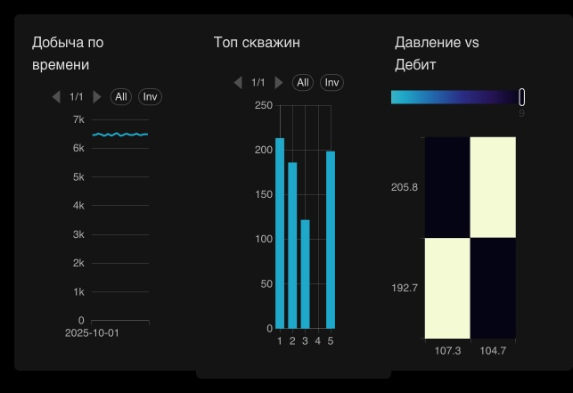

# oil-wells-data-pipeline
Домашние задание Big data и ML
<h1 align="center">Wells Analytics Pipeline</h1>

  Полный аналитический pipeline для нефтегазовых данных: 
  <b>PostgreSQL → ETL → MinIO → обработка → Jupyter → витрины → Superset</b>

  
  
  
  
  
  

<h2>📋 О проекте</h2>

  Проект реализует полный data pipeline для аналитики нефтегазовой компании:
  ETL из транзакционной БД в озеро данных, очистка и обогащение фичами,
  построение аналитических витрин, ML-модели прогноза и обнаружения аномалий,
  визуализация в BI-инструменте.

  Используется <b>medallion-архитектура</b> хранения:

<table>
  <tr>
    <th>Слой</th>
    <th>Где живёт</th>
    <th>Что содержит</th>
  </tr>
  <tr>
    <td><code>raw</code></td>
    <td>MinIO <code>s3://raw/</code></td>
    <td>Точная копия исходных таблиц в parquet, партиционирование по дате</td>
  </tr>
  <tr>
    <td><code>processed</code></td>
    <td>MinIO <code>s3://processed/</code></td>
    <td>Очищенные данные с инженерными фичами</td>
  </tr>
  <tr>
    <td><code>marts</code></td>
    <td>PostgreSQL <code>schema marts</code></td>
    <td>Денормализованные витрины для BI</td>
  </tr>
</table>

<h2>🏗 Архитектура</h2>

<pre>
┌──────────────┐    ┌──────────┐    ┌─────────────┐    ┌──────────────┐    ┌─────────────┐
│  PostgreSQL  │ →  │   ETL    │ →  │    MinIO    │ →  │  Processing  │ →  │  Postgres   │
│ (raw tables) │    │ (pandas) │    │  raw/       │    │   Jupyter    │    │  marts.*    │
└──────────────┘    └──────────┘    │  processed/ │    │ + sklearn ML │    └──────┬──────┘
                                    └─────────────┘    └──────────────┘           │
                                                                                   ▼
                                                                          ┌──────────────┐
                                                                          │   Superset   │
                                                                          │  dashboards  │
                                                                          └──────────────┘
</pre>

<h2>🧰 Стек</h2>

<ul>
  <li><b>Docker / Docker Compose</b> — оркестрация инфраструктуры</li>
  <li><b>PostgreSQL 16</b> — основное хранилище данных</li>
  <li><b>MinIO</b> — S3-совместимое объектное хранилище для parquet</li>
  <li><b>Jupyter Lab</b> — ноутбуки для ETL, очистки, ML</li>
  <li><b>Apache Superset</b> — BI-дашборды</li>
  <li><b>Apache Airflow</b> — поднят в инфраструктуре (для Advanced-расширения)</li>
</ul>

  Python-библиотеки: <code>pandas</code>, <code>sqlalchemy</code>, <code>psycopg2-binary</code>,
  <code>boto3</code>, <code>s3fs</code>, <code>pyarrow</code>, <code>scikit-learn</code>.

<h2>📁 Структура репозитория</h2>

<pre>
oil-wells-data-pipeline/
├── docker-compose.yml
├── README.md
│
├── jupyter/
│   ├── Dockerfile
│   └── requirements.txt
│
├── superset/
│   ├── Dockerfile
│   └── dashboards/                  # скриншоты дашбордов
│       ├── production.png
│       ├── ml_forecast.png
│       ├── anomalies.png
│       └── logistics.png
│
├── sql/                             # автозагрузка в Postgres при первом старте
│   ├── 01_schema.sql
│   ├── 02_wells.sql
│   └── ...
│
└── notebooks/
    ├── 01_tasks_2_3_4.ipynb     # этап 4: PG → MinIO
    ├── 02_task_5.ipynb   # этап 5: очистка + фичи
    ├── 03_zadanie_1.ipynb    # задание 1: аналитика добычи
    ├── 04_zadanie_2.ipynb   # задание 2: ML прогноз
    ├── 05_zadanie_3.ipynb     # задание 3: аномалии
    └── 06_zadanie_4.ipynb    # задание 4: логистика
</pre>

<h2>🚀 Быстрый старт</h2>

<h3>Требования</h3>

<ul>
  <li>Docker Desktop (или Docker Engine + Compose plugin)</li>
</ul>

<h3>Запуск</h3>

<pre><code>git clone &lt;repo-url&gt;
cd oil-wells-data-pipeline

docker compose up -d --build
</code></pre>

Первая сборка займёт 5–10 минут (скачивание образов + установка зависимостей).

<h3>Доступы</h3>

<table>
  <tr>
    <th>Сервис</th>
    <th>URL</th>
    <th>Логин / пароль</th>
  </tr>
  <tr>
    <td>Jupyter Lab</td>
    <td><a href="http://localhost:8888">localhost:8888</a></td>
    <td>токен: <code>jupyter</code></td>
  </tr>
  <tr>
    <td>Superset</td>
    <td><a href="http://localhost:8088">localhost:8088</a></td>
    <td><code>admin</code> / <code>admin</code></td>
  </tr>
  <tr>
    <td>MinIO Console</td>
    <td><a href="http://localhost:9001">localhost:9001</a></td>
    <td><code>admin</code> / <code>admin123</code></td>
  </tr>
  <tr>
    <td>PostgreSQL</td>
    <td><code>localhost:55432</code></td>
    <td><code>admin</code> / <code>admin</code> (db: <code>demo_db</code>)</td>
  </tr>
  <tr>
    <td>Airflow</td>
    <td><a href="http://localhost:8080">localhost:8080</a></td>
    <td><code>admin</code> / <code>admin</code></td>
  </tr>
</table>

<h2>📊 Этапы выполнения</h2>

  
<b>1. ETL: PostgreSQL → MinIO</b> &nbsp;·&nbsp; <code>01_tasks_2_3_4.ipynb</code>

  
Структура в MinIO:

  <pre>s3://raw/
├── wells/wells.parquet
├── production/date=2025-10-01/&lt;uuid&gt;.parquet
└── well_telemetry/date=2025-10-01/&lt;uuid&gt;.parquet
  </pre>

  
<b>2. Очистка и фичи</b> &nbsp;·&nbsp; <code>02_task_5.ipynb</code>

  <ul>
    <li>Обработка NULL по стратегии на колонку</li>
    <li>Фильтрация выбросов: бизнес-правила + IQR с k=3.0 для шумных сенсоров</li>
    <li>Агрегация почасовой телеметрии до уровня "день × скважина"</li>
    <li>Фичи: <code>avg_pressure</code>, <code>avg_temperature</code>, <code>downtime_ratio</code></li>
  </ul>

  
<b>3. Задание 1 — Аналитика добычи</b> &nbsp;·&nbsp; <code>03_zadanie_1.ipynb</code>

  
Витрины в схеме <code>marts</code>:

  <ul>
    <li><code>mart_production_daily</code> — суммарная добыча и средние сенсоры по дням</li>
    <li><code>mart_well_kpi</code> — KPI по скважинам (средний дебит, % простоя, ранги)</li>
    <li><code>mart_heatmap</code> — данные для heatmap</li>
  </ul>
  
Дашборд <b>Production Analytics</b>:

  <ul>
    <li>Line Chart — добыча по дням</li>
    <li>Bar Chart — топ скважин по среднему дебиту</li>
    <li>Heatmap — давление × дебит</li>
  </ul>
  

  
<b>4. Задание 2 — ML прогноз дебита</b> &nbsp;·&nbsp; <code>04_zadanie_2.ipynb</code>

  <ul>
    <li>Датасет: <code>daily</code> (после этапа 5) + таргет из <code>well_targets</code></li>
    <li>Фичи: давление, температура, мощность (<code>energy_kwh</code>), время работы насосов (<code>24 − downtime_hours</code>)</li>
    <li>Модель: <code>RandomForestRegressor</code> (100 деревьев)</li>
    <li>Метрики на тесте: <b>MAE = 0.255</b>, <b>RMSE = 0.345</b></li>
    <li>Витрина <code>marts.mart_predictions</code> с колонками <code>actual</code>, <code>predicted</code>, <code>error</code></li>
  </ul>
  
Дашборд <b>ML Forecast</b>:

  <ul>
    <li>Line Chart — Actual vs Predicted</li>
    <li>Line Chart — Error over time</li>
  </ul>
  

  
<b>5. Задание 3 — Аномалии и отказы</b> &nbsp;·&nbsp; <code>05_zadanie_3.ipynb</code>

  <ul>
    <li>Аномалии методом <b>z-score</b> (|z| &gt; 3)</li>
    <li>Аномалии методом <b>IsolationForest</b> (contamination=0.05)</li>
    <li>Анализ показаний за 24 часа до каждого отказа</li>
    <li>Бинарный классификатор <code>RandomForestClassifier</code> для вероятности отказа</li>
    <li>Витрина <code>marts.mart_failures</code> с risk score</li>
  </ul>
  
Дашборд <b>Equipment Health</b>:

  <ul>
    <li>Line Chart — аномалии по времени</li>
    <li>Line Chart — вибрация по насосам</li>
    <li>Bar Chart — средний risk score по насосам</li>
  </ul>
  

  
<b>6. Задание 4 — Логистика</b> &nbsp;·&nbsp; <code>06_zadanie_4.ipynb</code>

  <ul>
    <li>Факторы задержек: погода, расстояние (корреляция), водитель</li>
    <li>Стоимость: <code>cost_per_km = cost_usd / distance_km</code></li>
    <li>Оптимизация маршрутов: сортировка по <code>cost_per_km</code></li>
    <li>Витрина <code>marts.mart_logistics</code></li>
  </ul>
  
Дашборд <b>Logistics</b>:

  <ul>
    <li>Bar Chart — Delay vs Weather</li>
    <li>Scatter — Cost vs Distance</li>
    <li>Bar Chart — KPI по водителям</li>
  </ul>
  

<h2>✅ Закрытые требования ТЗ</h2>

<table>
  <tr>
    <th>Этап</th>
    <th>Реализация</th>
  </tr>
  <tr>
    <td>Инфраструктура (docker-compose)</td>
    <td>PostgreSQL + MinIO + Jupyter + Superset + Airflow</td>
  </tr>
  <tr>
    <td>Подключения (Jupyter ↔ PG, MinIO, Superset ↔ PG)</td>
    <td>Все подключения настроены и проверены</td>
  </tr>
  <tr>
    <td>Подготовка данных</td>
    <td>SQL-скрипты автоматически выполняются при первом старте Postgres</td>
  </tr>
  <tr>
    <td>ETL → MinIO (parquet, partitioning)</td>
    <td>Все таблицы выгружены, транзакционные — с партициями по дате</td>
  </tr>
  <tr>
    <td>Очистка, агрегации, фичи</td>
    <td>NULL, IQR-выбросы, day/well aggregations, downtime_ratio</td>
  </tr>
  <tr>
    <td>Задание 1 — аналитика добычи</td>
    <td>3 витрины + 3 чарта + дашборд</td>
  </tr>
  <tr>
    <td>Задание 2 — ML прогноз</td>
    <td>RandomForest, MAE/RMSE, 2 чарта</td>
  </tr>
  <tr>
    <td>Задание 3 — аномалии</td>
    <td>z-score + IsolationForest + классификатор отказа, 3 чарта</td>
  </tr>
  <tr>
    <td>Задание 4 — логистика</td>
    <td>факторы задержек, cost/km, 3 чарта</td>
  </tr>
</table>
